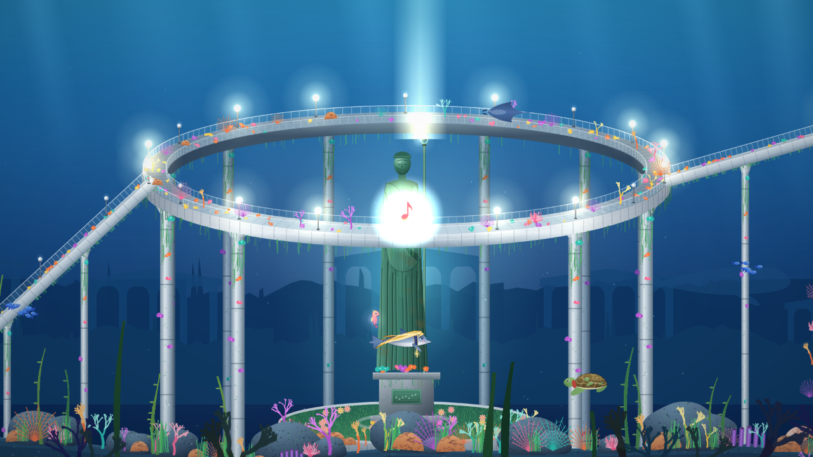
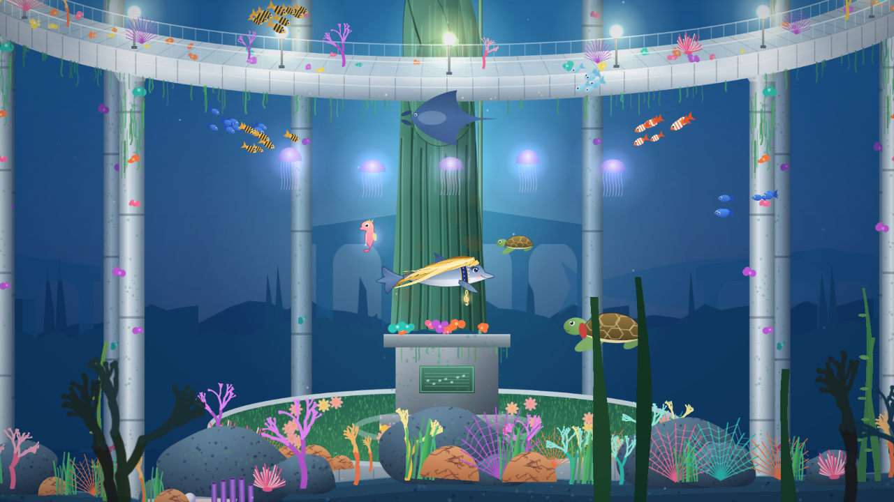

# ROSA THE DOLPHIN

*Una aventura en busca de la melodía perfecta.*

Vertical slice (5–10 min) de una aventura submarina musical y satírica en 2D: **Melodía I — La Rotonda Sumergida**.

Se acercan las elecciones en el océano. **Rosa**, presidenta de la **Coalición Delfinaria**, aún no tiene su
melodía perfecta… y sin melodía nadie le dará las gracias. Y a Rosa le encanta que le den las gracias.

En La Rotonda Sumergida reúne los 7 fragmentos de una melodía y la usa para «arreglar» los problemas del lugar:
las **colas de tortugas** de la rotonda, el **emisario de aguas residuales** y la **falta de cuevas** para los
delfines de aquí. Cada vez le dan las gracias, con arcoíris y estrellitas… y justo después aparece un
«MIENTRAS TANTO…» que enseña que el problema sigue ahí (o está peor). Al final: «Problemas resueltos de verdad: 1 ·
Según Rosa: todos». **¡Gracias, Rosa the Dolphin!**

Phaser 3 · TypeScript · Vite. Todo el arte se genera por código; la única pieza externa es el tema musical.




## Jugar online

**https://fireternal.github.io/RosaTheDolphin/** — se publica automáticamente con cada cambio en `main` (GitHub Pages). Ordenador (teclado) o móvil/tablet en horizontal (táctil), con sonido.

## Arrancar en local

```bash
git clone https://github.com/Fireternal/RosaTheDolphin.git
cd RosaTheDolphin
npm install
npm run dev        # http://localhost:5173
npm run build      # typecheck + build de producción en dist/
```

## Móvil y tablet

Se juega en horizontal (si el móvil está en vertical aparece un aviso para girarlo). El primer toque pone el
juego a pantalla completa y lo gira a horizontal donde el navegador lo permite (Android). Controles táctiles:
joystick a la izquierda (arrastra el dedo; al fondo, nada más rápido), botones **IMPULSO**, **SONAR** y **E**
a la derecha, **II** para pausa/salir de un puzle, y las notas de los puzles se tocan con el dedo.

## Controles

| Tecla | Acción |
|---|---|
| WASD / flechas | Nadar (movimiento libre con inercia) |
| SHIFT | Nadar más rápido |
| ESPACIO | Impulso (con carrerilla hacia arriba, Rosa salta sobre las olas) |
| Q | Sonar musical: revela secretos, despierta cosas, hace reaccionar a los animales |
| E | Interactuar / escuchar una melodía |
| 1–7 | Tocar DO RE MI FA SOL LA SI (también clicables durante un puzle) |
| ESC | Pausa / salir de un puzle |
| M | Silenciar |
| F | Pantalla completa (también con el botón de arriba) |

## El nivel

Los 7 fragmentos de la melodía final (SOL LA SOL MI FA RE DO), cada uno con una forma distinta de conseguirlo:

1. **Explorando**: en aguas abiertas, junto al lugar de llegada.
2. **Escondido**: bajo la rampa oeste, invisible hasta que el sonar lo revela.
3. **Sonar**: la Almeja Gigante solo despierta con el sonar.
4. **Criatura**: lleva a Bruno, la tortuga pequeña perdida en las algas de la superficie, con su abuela Doña Marea.
5. **Puzle 1 — La Puerta de Coral**: escucha la caracola y repite SOL MI DO RE. La puerta se abre, el coral florece, vuelven los peces payaso.
6. **Puzle 2 — El Órgano de las Mareas**: MI SOL LA SI invierte la corriente de la torre, que sube a Rosa hasta el fragmento.
7. **Salto**: un destello flota sobre las olas, encima de la Rotonda; hay que coger impulso y saltar fuera del agua.

Con los siete, el bastón de la estatua central se ilumina. Allí se interpreta la melodía completa: las notas
recorren la rotonda, se encienden las luces, florecen los corales, llegan los peces, todas las capas de la música
suenan juntas… silencio… y la Rotonda entera da las gracias.

Las 7 notas sueltas forman el repertorio de Rosa (dos de ellas solo aparecen con el sonar). Lumi, el caballito
de mar que la acompaña, da pistas según el progreso (E junto a ella). El progreso se guarda en `localStorage`
(menú → CONTINUAR).

## Tu propia música

Menú → **MÚSICA** → «Elegir una canción de mi dispositivo…». La canción sustituye al tema oficial: empieza lejana y amortiguada y se abre con cada fragmento, hasta sonar completa en el final.
Se guarda solo en el navegador (IndexedDB), no se sube a ningún sitio ni forma parte del juego publicado.
«Usar el tema oficial de Rosa» vuelve a la música del juego.

## Música

El tema principal es **«Rosa the Dolphin»** (`public/music/rosa-theme.ogg`, con copia MP3 para Safari), aportado
por el autor del proyecto como música sin derechos de terceros. Dentro del nivel empieza suave y se abre con cada
fragmento; en el final suena completo.

## Banda sonora generada (respaldo)

`AudioManager` sintetiza todo con Web Audio (envolventes, armónicos, reverb por convolución) y un secuenciador
por capas: al empezar solo hay agua y pads; cada fragmento añade una capa (piano → cuerdas → percusión suave → arpa
→ viento → armonía → melodía principal). Cada nota recogida añade campanillas con esa nota al ambiente. En el final
entra la versión completa (melodía al frente + coro). `AudioManager.loadSample(instrumento, url)` permite sustituir
cualquier instrumento por un sample real más adelante.

## Arquitectura

```
src/
  main.ts                 configuración de Phaser (1920x1080, escala FIT adaptativa)
  config.ts               notas, colores, profundidades, nombres de capas
  scenes/                 Boot, Preload (genera texturas), Menu, Intro, Game, UI (HUD/overlays), Ending
  entities/               RosaPlayer (cuerpo + melena simulada), SwimmingController, MusicalNote,
                          MelodyFragment, Creatures (Lumi, tortugas, bancos de peces, medusas, manta)
  systems/                AudioManager, SonarSystem, MusicPuzzle, MusicSequence, GratitudeSystem,
                          DialogueSystem (en UIScene), ObjectiveSystem, SaveManager, ParticleManager
  level/                  RotondaData (geometría compartida), RotondaBuilder (capas y parallax), missions
  art/                    arte procedural en canvas: Rosa, entorno, criaturas, efectos
```

**GratitudeSystem** es el sistema de progresión narrativa reutilizable: cada misión declara quién necesita ayuda,
qué problema tiene, qué melodía lo resuelve, qué transformación provoca, quién da las gracias y con qué palabras
(`tone: 'small' | 'warm' | 'grand'`). Un nivel nuevo solo registra sus misiones y llama a `thank(id)`; los
agradecimientos quedan guardados y se cuentan en el HUD.

## QA automatizado

```bash
npm run dev                  # en otra terminal
npm run qa                   # juega el nivel entero en Chromium con teclado real
```

`scripts/qa.mjs` recorre menú → intro → nado/inercia → sonar → notas ocultas → 7 fragmentos → ambos puzles
(incluido un error a propósito) → corriente → salto → final → «¡GRACIAS, ROSA THE DOLPHIN!» → pantalla final →
reinicio, comprueba el guardado y los errores de consola, y deja capturas en `qa-output/`. Para viajar entre zonas
usa un `teleport` de depuración (solo con `?debug` o en `npm run dev`); recogidas, puzles y eventos usan la lógica
real. Necesita Chrome/Chromium (`CHROME_PATH=...`). En máquinas sin GPU, `QA_RENDERER=canvas` va más rápido
(el modo Canvas no aplica tintes, así que los colores no son representativos).
